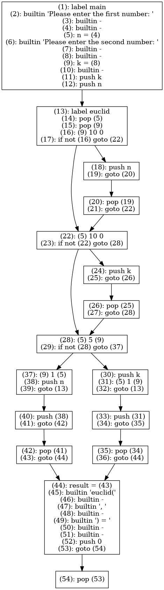

# Yet another mc Compiler

This repository holds the code-base from UIBK [compiler construction course](https://git.uibk.ac.at/c7031162/703602-Compiler-Construction) group 5.

## Authors
- Andreas Peintner (1515339)
- Josef Gugglberger (1518418)
- Tobias Kupek (11828471)

## Prerequisites

- [Meson](http://mesonbuild.com/) in a recent version (`0.44.0`)
  (you may want to install it via `pip3 install --user meson`)
- [Ninja](https://ninja-build.org/)
- `time`, typically located at `/usr/bin/time`, do not confuse this with the Bash built-in
- `flex` for generating the lexer
- `bison` for generating the parser
- A compiler supporting C11 — typically GCC or Clang

## Build Instructions

First, generate the build directory.

    $ meson builddir
    $ cd builddir

Meson creates Ninja build files.
Let's build.

    $ ninja

Unit tests can be run directly with Ninja (or Meson).

    $ ninja test

For integration testing we try to compile .mc programs and compare their output for a given input.

    $ ../scripts/run_integration_tests

Taken from the [Meson Documentation](https://mesonbuild.com/Unit-tests.html#coverage):

> If you enable coverage measurements by giving Meson the command line flag `-Db_coverage=true`, you can generate coverage reports.
> Meson will autodetect what coverage generator tools you have installed and will generate the corresponding targets.
> These targets are `coverage-xml` and `coverage-text` which are both provided by Gcovr and `coverage-html`, which requires Lcov and GenHTML or Gcovr with html support.

## Known Issues
currenly none

## Milestone 1 Parser

__Main goals__

- Inputs are accepted / rejected correctly (syntax only).
- Syntactically invalid inputs result in a meaningful error message containing the corresponding source location.
- An AST is constructed for valid inputs.
- The obtained AST can be printed in the DOT format (see mc_ast_to_dot).

__Testing the objective__

To verify the correct behavious, please follow the [Build Instructions](#build-instructions) from above.
Afterwards the `mc_ast_to_dot` binary can produce the DOT output:

```
cat ../examples/euclid/euclid.mc | ./mc_ast_to_dot
```

A graphical output is available through graphviz:

```
cat ../examples/euclid/euclid.mc | ./mc_ast_to_dot | dot -Tpng > euclid_ast.png
```

__Example output__



__Examples for rejected code__

Code with incorrect syntax is rejected with an error that includes the line, column and a message.

Examples are an invalid type, an incorrect comment and a missing semicolon.

```
echo 'int main() {int i; ind e;}' | ./mc_ast_to_dot
echo 'int main() {/ this is an incorrect comment}' | ./mc_ast_to_dot
echo 'int main() {int i; i = 1 + 1}' | ./mc_ast_to_dot
```


## Milestone 2 Semantic Checks

__Main goals__

- The compiler rejects semantically wrong inputs.
- Invalid inputs trigger a meaningful error message including source location information.
- Type checking can be traced (see mc_type_check_trace).
- Symbol tables can be viewed (see mc_symbol_table).

__Testing the objective__

To verify the correct behavious, please follow the [Build Instructions](#build-instructions) from above.
Afterwards the `mc_symbol_table` binary can produce the symbol table output and the `mc_type_check_trace` will perform semantic type checking.

```
./mc_symbol_table ../test/integration/euclid/euclid.mc
```

```
./mc_type_check_trace ../test/integration/euclid/euclid.mc
```

__Example output__

symbol table
```
[symbol_table global]
name            |       type
-----------------------------
print           |       VOID
print_nl                |       VOID
print_int               |       VOID
print_float             |       VOID
read_int                |       INT
read_float              |       FLOAT
euclid          |       INT
main            |       INT

[symbol_table euclid]
name            |       type
-----------------------------
n               |       INT
k               |       INT

[symbol_table main]
name            |       type
-----------------------------
n               |       INT
k               |       INT
result          |       INT

[symbol_table anonymous]
name            |       type
-----------------------------

[symbol_table anonymous]
name            |       type
-----------------------------

[symbol_table anonymous]
name            |       type
-----------------------------

[symbol_table anonymous]
name            |       type
-----------------------------
```

type-checking trace

```
Location        |       Expression      |       Type-LHS - Type-RHS     |       Status
--------------------------------------------------------------------------------------
3:7             |       bin op          |       INT ~ INT               |       VALID
4:9             |       return          |       INT ~ INT               |       VALID
7:7             |       bin op          |       INT ~ INT               |       VALID
8:9             |       return          |       INT ~ INT               |       VALID
11:7            |       bin op          |       INT ~ INT               |       VALID
12:18           |       bin op          |       INT ~ INT               |       VALID
12:9            |       return          |       INT ~ INT               |       VALID
14:21           |       bin op          |       INT ~ INT               |       VALID
14:9            |       return          |       INT ~ INT               |       VALID
1:15            |       declare n       |       INT                     |       VALID
1:22            |       declare k       |       INT                     |       VALID
23:5            |       declare n       |       INT                     |       VALID
24:3            |       assign n        |       INT <- INT              |       VALID
29:5            |       declare k       |       INT                     |       VALID
30:3            |       assign k        |       INT <- INT              |       VALID
33:5            |       declare result  |       INT                     |       VALID
34:8            |       assign result   |       INT <- INT              |       VALID
44:8            |       return          |       INT ~ INT               |       VALID
```

__Examples for rejected code__

Code with semantic errors is rejected with an error that includes the line, column and a message.

Examples are the usage of an undeclared variable, missing return statement or a wrong type in assignment.

```
int main() { i = 1; return 0; } -> ./test.mc:1:15: error: undefined identifier (id 'i')
int main() { } -> ./test.mc:1:4: error: no return value in non void function (func 'main')
int main() { int i; i = "foobar"; return 0; } -> ./test.mc:1:22: error: invalid assignment (expected type 'INT', but got type 'STRING')
```