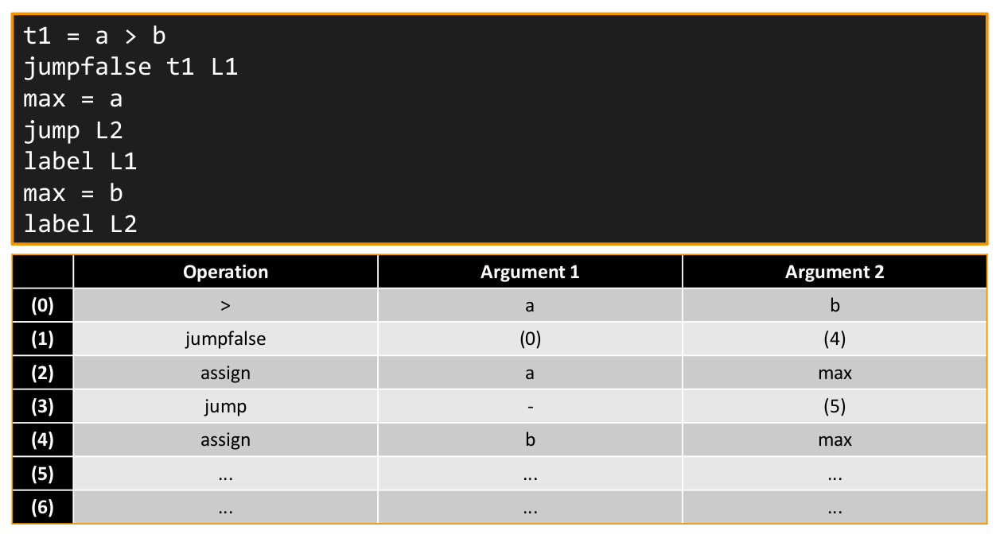

## Milestone 3 - IR Generation and Control Flow Graph

__Main goals__

* Valid inputs are converted to IR.
* The IR can be printed (see mc_ir).
* The CFG is generated and can be printed in the DOT format (see mc_cfg_to_dot).

__Theory__

Our IR was inspired by the concept of Triples presented in Lecture 6.



__Testing the objective__

To verify the correct behaviour, please follow the [Build Instructions](#build-instructions) from above.
Afterwards the `mc_ir` binary can produce the intermediate representation and the `mc_cfg_to_dot` will produce an output in the DOT format to visualize the CFG.

```
./mc_ir ../test/integration/euclid/euclid.mc
```

```
./mc_cfg_to_dot ../test/integration/euclid/euclid.mc
```

For the CFG a graphical output is available through graphviz:
(make sure that the log level is set to 0 to make this work)

```
./mc_cfg_to_dot ../test/integration/euclid/euclid.mc | dot -Tpng > euclid_cfg.png
```

__Example output__

```
generate IR code...

-------------------------------------------------------------------------------------------------------------
| index | operation     | argument 1                              | argument 2                              |
-------------------------------------------------------------------------------------------------------------
| 1     | label         | main                                    | -                                       |
| 2     | push          | "Please enter the first number: "       | -                                       |
| 3     | label         | print                                   | -                                       |
| 4     | pop           | "Please enter the first number: "       | -                                       |
| 5     | label         | print_nl                                | -                                       |
| 6     | label         | read_int                                | -                                       |
| 7     | assign        | n                                       | (6)                                     |
| 8     | push          | "Please enter the second number: "      | -                                       |
| 9     | label         | (3)                                     | -                                       |
| 10    | pop           | "Please enter the second number: "      | -                                       |
| 11    | label         | (5)                                     | -                                       |
| 12    | label         | (6)                                     | -                                       |
| 13    | assign        | k                                       | (12)                                    |
| 14    | label         | (5)                                     | -                                       |
| 15    | push          | k                                       | -                                       |
| 16    | push          | n                                       | -                                       |
| 17    | label         | euclid                                  | -                                       |
| 18    | pop           | (7)                                     | -                                       |
| 19    | pop           | (13)                                    | -                                       |
| 20    | ==            | (13)                                    | 0                                       |
| 21    | jumpfalse     | (20)                                    | (26)                                    |
| 22    | push          | n                                       | -                                       |
| 23    | jump          | (24)                                    | -                                       |
| 24    | pop           | (23)                                    | -                                       |
| 25    | jump          | (26)                                    | -                                       |
| 26    | ==            | (7)                                     | 0                                       |
| 27    | jumpfalse     | (26)                                    | (32)                                    |
| 28    | push          | k                                       | -                                       |
| 29    | jump          | (30)                                    | -                                       |
| 30    | pop           | (29)                                    | -                                       |
| 31    | jump          | (32)                                    | -                                       |
| 32    | >             | (7)                                     | (13)                                    |
| 33    | jumpfalse     | (32)                                    | (41)                                    |
| 34    | push          | k                                       | -                                       |
| 35    | -             | (7)                                     | (13)                                    |
| 36    | jump          | (17)                                    | -                                       |
| 37    | push          | (35)                                    | -                                       |
| 38    | jump          | (39)                                    | -                                       |
| 39    | pop           | (38)                                    | -                                       |
| 40    | jump          | (48)                                    | -                                       |
| 41    | -             | (13)                                    | (7)                                     |
| 42    | push          | n                                       | -                                       |
| 43    | jump          | (17)                                    | -                                       |
| 44    | push          | (42)                                    | -                                       |
| 45    | jump          | (46)                                    | -                                       |
| 46    | pop           | (45)                                    | -                                       |
| 47    | jump          | (48)                                    | -                                       |
| 48    | assign        | result                                  | (47)                                    |
| 49    | push          | "euclid("                               | -                                       |
| 50    | label         | (3)                                     | -                                       |
| 51    | pop           | "euclid("                               | -                                       |
| 52    | push          | n                                       | -                                       |
| 53    | label         | print_int                               | -                                       |
| 54    | pop           | (7)                                     | -                                       |
| 55    | push          | ", "                                    | -                                       |
| 56    | label         | (3)                                     | -                                       |
| 57    | pop           | ", "                                    | -                                       |
| 58    | push          | k                                       | -                                       |
| 59    | label         | (53)                                    | -                                       |
| 60    | pop           | (13)                                    | -                                       |
| 61    | push          | ") = "                                  | -                                       |
| 62    | label         | (3)                                     | -                                       |
| 63    | pop           | ") = "                                  | -                                       |
| 64    | push          | result                                  | -                                       |
| 65    | label         | (53)                                    | -                                       |
| 66    | pop           | (48)                                    | -                                       |
| 67    | label         | (5)                                     | -                                       |
| 68    | push          | 0                                       | -                                       |
| 69    | jump          | (70)                                    | -                                       |
| 70    | pop           | (69)                                    | -                                       |
-------------------------------------------------------------------------------------------------------------
```

